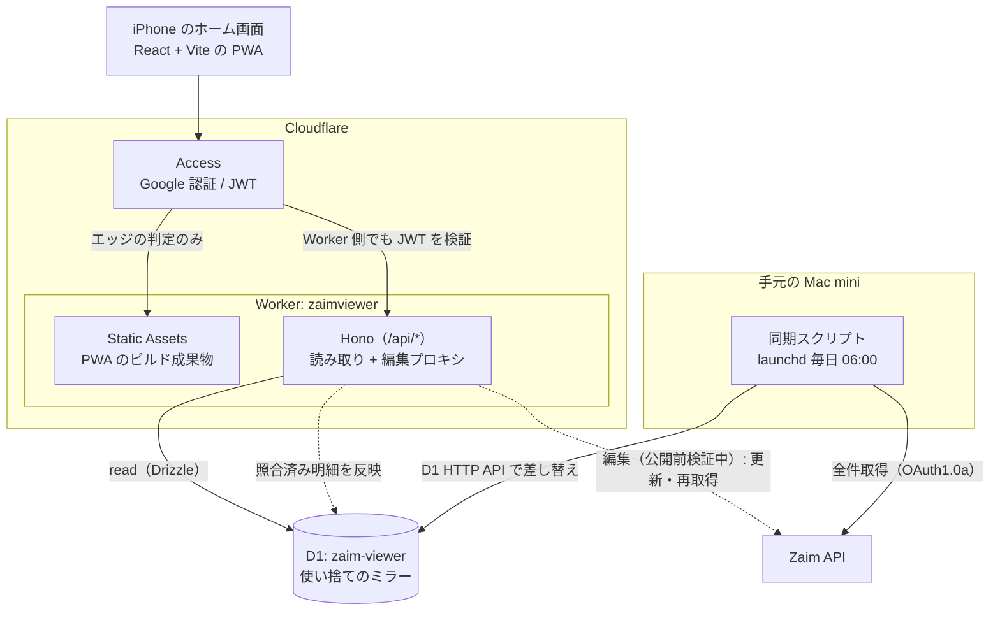

# ZaimViewer

家計簿アプリ [Zaim](https://zaim.net/) の明細を Cloudflare D1 にミラーし、
iPhone から絞り込んで読むための PWA。個人利用のために作っているもので、
配布や汎用化は狙っていない。

**本番:** https://zaimviewer.ries.workers.dev
（Cloudflare Access で保護しているため、許可されたアカウント以外は開けない）

## 何を解決するか

**Zaim 本体でも絞り込みはできる。** できないのではなく、日常的に使うには手間が多い。

- 既定の絞り込みを持てない。振替の除外すら毎回指定し直すことになる
- 検索を実行するまで、結果も件数も分からない
- 項目を横断したキーワード検索がない
- 期間のプリセット（前月など）がない
- 期間に初期値が入っており、そのままだと意図しない範囲で検索される
- 指定できる項目が多く、目的の条件に辿り着くまでが遠い

その結果、金融機関連携で自動的に入ってくる細かな履歴に、振替や大きな入出金が
埋もれたままになる。**読みたいものを読むための操作が重すぎる**、というのが
このプロジェクトの出発点。

そこで**閲覧層だけを自作する**ことにした。Zaim を置き換えるのではなく、
記録は Zaim のまま、読む手段を足す。Directus や Metabase のような汎用ツールを
使わなかった理由は [ADR-0001](docs/adr/0001-build-viewer-instead-of-generic-tools.md)。

## 構成



矢印は「どちらがどちらを呼ぶか」の向きで、データはその逆に流れる。
押さえておきたいのは 3 点。

- **同期だけが Cloudflare の外にいる。** Workers の CPU 時間と D1 の
  invocation あたりクエリ数のどちらにも収まらず、有料プランでも解決しない
  → [ADR-0015](docs/adr/0015-sync-outside-worker.md)
- **D1 は使い捨てのミラーで、正は常に Zaim。** ローカル独自のデータを持たず、
  除外はクエリのルールとして表現する
  → [ADR-0002](docs/adr/0002-no-local-only-data.md)
- **静的アセットは Worker を通らない。** 家計データはすべて `/api/*` の
  向こうにあり、そこは Access のエッジ判定に加えて Worker 自身の JWT 検証も通る
  → [ADR-0020](docs/adr/0020-single-package-vite-worker.md)、
  [ADR-0019](docs/adr/0019-verify-access-jwt-in-worker.md)

## 現在地

| 工程 | 状態 |
|---|---|
| ① 同期基盤（Zaim → D1） | 完了。Zaim から全件取得して差し替える。実測 22 秒 |
| ② 読み取り API + PWA | 完了。一覧・フィルタ・明細の詳細まで。iPhone のホーム画面から standalone で起動する |
| ③ 編集機能（編集プロキシ・一括編集） | 単体・一括編集を実装。実データと実機による公開前検証中（[#6](https://github.com/Ries630/ZaimViewer/issues/6)） |

**既知の欠け: ミラーは Zaim の全件ではない。** 金融機関連携で取り込まれた明細の
一部が Zaim の API から返らず、画面にも出てこない
（[#33](https://github.com/Ries630/ZaimViewer/issues/33)）。

編集機能の公開手順と中断後の復旧は [編集の運用手順](ops/editing.md) を参照する。
公開前検証が済むまでは編集を無効にしている。

## ディレクトリの読み方

リポジトリルートがアプリのルートで、クライアントと Worker が 1 パッケージに
同居している（[ADR-0020](docs/adr/0020-single-package-vite-worker.md)）。
**コマンドはすべてリポジトリルートで実行する。**

| パス | 中身 |
|---|---|
| `src/` | PWA。`api/` が RPC クライアント、`components/` が画面、`lib/` がテスト対象の純関数 |
| `worker/src/` | Worker。ルート定義は `index.ts`、フィルタの SQL 組み立ては `queries.ts` |
| `worker/scripts/` | 手元の Bun で走らせるスクリプト（同期・スキーマ初期化） |
| `worker/test/` | vitest。workerd 上で実物の D1 を使って走る |
| `tools/oxlint/anti-slop/` | ベンダリングした Oxlint プラグイン（[ADR-0032](docs/adr/0032-anti-slop-lint-rules.md)） |
| `docs/adr/` | 設計判断の記録 |
| `ops/` | 手元での同期の運用（launchd） |

## 開発

```bash
bun install
bun run dev    # PWA と Worker を :5173 に同居させて起動（ローカル D1）
bun run check  # format:check → lint → typecheck → test → build を一括
bun run sync   # 本番 D1 を Zaim から全件更新（手元で実行する同期）
```

Zaim の OAuth1.0a 認証情報と、同期用の Cloudflare トークンを
リポジトリルートの `.dev.vars` に置く（項目は [`.dev.vars.example`](.dev.vars.example) を参照）。

**lint には node 24 が要る。** ベンダリングした Oxlint プラグインが `.ts` のまま
読まれるため、型ストリップが既定で効かない環境では設定の読み込みごと失敗する。

コマンドの全量と、踏むと壊れる箇所（型検査が 3 プログラムに分かれている理由、
`worker-configuration.d.ts` が手元と CI で違う型になる理由など）は
[`AGENTS.md`](AGENTS.md) にある。

## さらに読む

| 読むもの | 何が書いてあるか |
|---|---|
| [`AGENTS.md`](AGENTS.md) | 実装上の規範と制約。守らないと壊れるものの一覧 |
| [`docs/adr/`](docs/adr/README.md) | 設計判断の理由・却下した代替・再評価のサイン |
| [`ops/README.md`](ops/README.md) | 手元での同期の運用（手動実行・launchd・ログ） |
